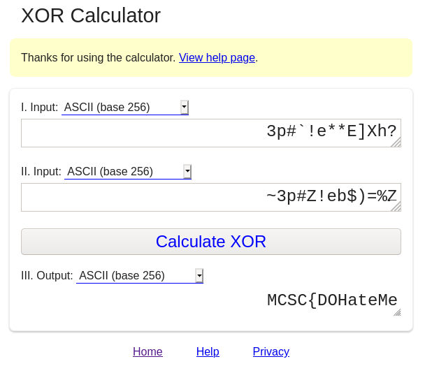
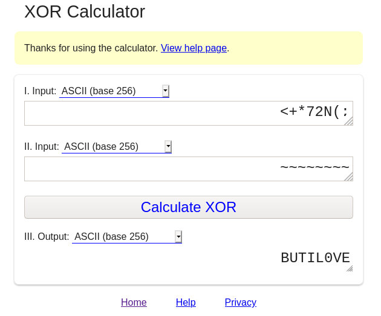

## MCSC 2020
### whoami (pwn)(100)


Let's download and check file type in terminal
```shell
file mcsc_ch4
```
> mcsc_ch4: ELF 64-bit LSB shared object, x86-64, version 1 (SYSV), dynamically linked, interpreter /lib64/ld-linux-x86-64.so.2, BuildID[sha1]=ed996c9bae8ff1af7f6a0732ad5b86ab9d221309, for GNU/Linux 3.2.0, not stripped

Ok, let give him executable permission
```shell
chmod +x mcsc_ch4
```
and run him
```shell
./mcsc_ch4
```
> What do you expected?..
> Feeling so great!

Ok, nothing more
let's try with gdb
```shell
gdb -q ./mcsc_ch4
```
check functions
```
(gdb) info functions
All defined functions:

Non-debugging symbols:
0x0000000000001000  _init
0x0000000000001090  __cxa_finalize@plt
0x00000000000010a0  puts@plt
0x00000000000010b0  strlen@plt
0x00000000000010c0  __stack_chk_fail@plt
0x00000000000010d0  getuid@plt
0x00000000000010e0  strncat@plt
0x00000000000010f0  getgid@plt
0x0000000000001100  _start
0x0000000000001130  deregister_tm_clones
0x0000000000001160  register_tm_clones
0x00000000000011a0  __do_global_dtors_aux
0x00000000000011e0  frame_dummy
0x00000000000011e9  main
0x0000000000001390  __libc_csu_init
0x0000000000001400  __libc_csu_fini
0x0000000000001408  _fini
(gdb) 
```
Disassemble main
```
(gdb) b main
Breakpoint 1 at 0x11e9
(gdb) r
Starting program: /tmp/ctf/mcsc_ch4 

Breakpoint 1, 0x00005555555551e9 in main ()
(gdb) disas main
Dump of assembler code for function main:
=> 0x00005555555551e9 <+0>:	endbr64 
   0x00005555555551ed <+4>:	push   %rbp
   0x00005555555551ee <+5>:	mov    %rsp,%rbp
   0x00005555555551f1 <+8>:	push   %rbx
   0x00005555555551f2 <+9>:	sub    $0x68,%rsp
   0x00005555555551f6 <+13>:	mov    %fs:0x28,%rax
   0x00005555555551ff <+22>:	mov    %rax,-0x18(%rbp)
   0x0000555555555203 <+26>:	xor    %eax,%eax
   0x0000555555555205 <+28>:	callq  0x5555555550d0 <getuid@plt>
   0x000055555555520a <+33>:	mov    %eax,-0x60(%rbp)
   0x000055555555520d <+36>:	callq  0x5555555550f0 <getgid@plt>
   0x0000555555555212 <+41>:	mov    %eax,-0x5c(%rbp)
   0x0000555555555215 <+44>:	lea    0xde8(%rip),%rdi        # 0x555555556004
   0x000055555555521c <+51>:	callq  0x5555555550a0 <puts@plt>
   0x0000555555555221 <+56>:	cmpl   $0x1ca3,-0x60(%rbp)
   0x0000555555555228 <+63>:	jne    0x555555555358 <main+367>
   0x000055555555522e <+69>:	movabs $0x2a2a652160237033,%rax
   0x0000555555555238 <+79>:	mov    %rax,-0x34(%rbp)
   0x000055555555523c <+83>:	movl   $0x68585d45,-0x2c(%rbp)
   0x0000555555555243 <+90>:	movw   $0x3f,-0x28(%rbp)
   0x0000555555555249 <+96>:	movabs $0x6265215a2370337e,%rax
   0x0000555555555253 <+106>:	mov    %rax,-0x26(%rbp)
--Type <RET> for more, q to quit, c to continue without paging--
   0x0000555555555257 <+110>:	movl   $0x253d2924,-0x1e(%rbp)
   0x000055555555525e <+117>:	movw   $0x5a,-0x1a(%rbp)
   0x0000555555555264 <+123>:	movl   $0x0,-0x68(%rbp)
   0x000055555555526b <+130>:	jmp    0x555555555297 <main+174>
   0x000055555555526d <+132>:	mov    -0x68(%rbp),%eax
   0x0000555555555270 <+135>:	cltq   
   0x0000555555555272 <+137>:	movzbl -0x34(%rbp,%rax,1),%edx
   0x0000555555555277 <+142>:	mov    -0x68(%rbp),%eax
   0x000055555555527a <+145>:	cltq   
   0x000055555555527c <+147>:	movzbl -0x26(%rbp,%rax,1),%eax
   0x0000555555555281 <+152>:	xor    %edx,%eax
   0x0000555555555283 <+154>:	mov    %al,-0x69(%rbp)
   0x0000555555555286 <+157>:	mov    -0x68(%rbp),%eax
   0x0000555555555289 <+160>:	cltq   
   0x000055555555528b <+162>:	movzbl -0x69(%rbp),%edx
   0x000055555555528f <+166>:	mov    %dl,-0x4e(%rbp,%rax,1)
   0x0000555555555293 <+170>:	addl   $0x1,-0x68(%rbp)
   0x0000555555555297 <+174>:	mov    -0x68(%rbp),%eax
   0x000055555555529a <+177>:	movslq %eax,%rbx
   0x000055555555529d <+180>:	lea    -0x34(%rbp),%rax
   0x00005555555552a1 <+184>:	mov    %rax,%rdi
   0x00005555555552a4 <+187>:	callq  0x5555555550b0 <strlen@plt>
   0x00005555555552a9 <+192>:	cmp    %rax,%rbx
--Type <RET> for more, q to quit, c to continue without paging--
   0x00005555555552ac <+195>:	jb     0x55555555526d <main+132>
   0x00005555555552ae <+197>:	mov    -0x68(%rbp),%eax
   0x00005555555552b1 <+200>:	cltq   
   0x00005555555552b3 <+202>:	movb   $0x0,-0x4e(%rbp,%rax,1)
   0x00005555555552b8 <+207>:	lea    0xd5d(%rip),%rdi        # 0x55555555601c
   0x00005555555552bf <+214>:	callq  0x5555555550a0 <puts@plt>
   0x00005555555552c4 <+219>:	cmpl   $0x539,-0x5c(%rbp)
   0x00005555555552cb <+226>:	jne    0x555555555364 <main+379>
   0x00005555555552d1 <+232>:	movabs $0x3b284e32372a2b3c,%rax
   0x00005555555552db <+242>:	mov    %rax,-0x57(%rbp)
   0x00005555555552df <+246>:	movb   $0x0,-0x4f(%rbp)
   0x00005555555552e3 <+250>:	movb   $0x7d,-0x6b(%rbp)
   0x00005555555552e7 <+254>:	movl   $0x0,-0x64(%rbp)
   0x00005555555552ee <+261>:	jmp    0x555555555311 <main+296>
   0x00005555555552f0 <+263>:	mov    -0x64(%rbp),%eax
   0x00005555555552f3 <+266>:	cltq   
   0x00005555555552f5 <+268>:	movzbl -0x57(%rbp,%rax,1),%eax
   0x00005555555552fa <+273>:	xor    $0x7e,%eax
   0x00005555555552fd <+276>:	mov    %al,-0x6a(%rbp)
   0x0000555555555300 <+279>:	mov    -0x64(%rbp),%eax
   0x0000555555555303 <+282>:	cltq   
   0x0000555555555305 <+284>:	movzbl -0x6a(%rbp),%edx
   0x0000555555555309 <+288>:	mov    %dl,-0x41(%rbp,%rax,1)
--Type <RET> for more, q to quit, c to continue without paging--
   0x000055555555530d <+292>:	addl   $0x1,-0x64(%rbp)
   0x0000555555555311 <+296>:	mov    -0x64(%rbp),%eax
   0x0000555555555314 <+299>:	movslq %eax,%rbx
   0x0000555555555317 <+302>:	lea    -0x57(%rbp),%rax
   0x000055555555531b <+306>:	mov    %rax,%rdi
   0x000055555555531e <+309>:	callq  0x5555555550b0 <strlen@plt>
   0x0000555555555323 <+314>:	cmp    %rax,%rbx
   0x0000555555555326 <+317>:	jb     0x5555555552f0 <main+263>
   0x0000555555555328 <+319>:	mov    -0x64(%rbp),%eax
   0x000055555555532b <+322>:	cltq   
   0x000055555555532d <+324>:	movb   $0x0,-0x41(%rbp,%rax,1)
   0x0000555555555332 <+329>:	lea    -0x6b(%rbp),%rcx
   0x0000555555555336 <+333>:	lea    -0x41(%rbp),%rax
   0x000055555555533a <+337>:	mov    $0x1,%edx
   0x000055555555533f <+342>:	mov    %rcx,%rsi
   0x0000555555555342 <+345>:	mov    %rax,%rdi
   0x0000555555555345 <+348>:	callq  0x5555555550e0 <strncat@plt>
   0x000055555555534a <+353>:	lea    0xcdb(%rip),%rdi        # 0x55555555602c
   0x0000555555555351 <+360>:	callq  0x5555555550a0 <puts@plt>
   0x0000555555555356 <+365>:	jmp    0x555555555364 <main+379>
   0x0000555555555358 <+367>:	lea    0xcd6(%rip),%rdi        # 0x555555556035
   0x000055555555535f <+374>:	callq  0x5555555550a0 <puts@plt>
   0x0000555555555364 <+379>:	mov    $0x0,%eax
--Type <RET> for more, q to quit, c to continue without paging--
   0x0000555555555369 <+384>:	mov    -0x18(%rbp),%rsi
   0x000055555555536d <+388>:	xor    %fs:0x28,%rsi
   0x0000555555555376 <+397>:	je     0x55555555537d <main+404>
   0x0000555555555378 <+399>:	callq  0x5555555550c0 <__stack_chk_fail@plt>
   0x000055555555537d <+404>:	add    $0x68,%rsp
   0x0000555555555381 <+408>:	pop    %rbx
   0x0000555555555382 <+409>:	pop    %rbp
   0x0000555555555383 <+410>:	retq   
End of assembler dump.
```
Nice, a lot of codes...
Let me take out some interesting **instructions**

```
0x000055555555522e <+69>:	movabs $0x2a2a652160237033,%rax
0x0000555555555238 <+79>:	mov    %rax,-0x34(%rbp)
0x000055555555523c <+83>:	movl   $0x68585d45,-0x2c(%rbp)
0x0000555555555243 <+90>:	movw   $0x3f,-0x28(%rbp)

0x0000555555555249 <+96>:	movabs $0x6265215a2370337e,%rax
0x0000555555555253 <+106>:	mov    %rax,-0x26(%rbp)
0x0000555555555257 <+110>:	movl   $0x253d2924,-0x1e(%rbp)
0x000055555555525e <+117>:	movw   $0x5a,-0x1a(%rbp)
0x0000555555555264 <+123>:	movl   $0x0,-0x68(%rbp)
```
there must be two strings
and below I found ```xor``` operation
```
0x0000555555555281 <+152>:	xor    %edx,%eax
```

Let's ```xor``` those two strings

First, let's change hex values to string in ```python```
Open python in terminal
```
# python
Python 2.7.18 (default, Apr 20 2020, 20:30:41) 
[GCC 9.3.0] on linux2
Type "help", "copyright", "credits" or "license" for more information.
>>> 
```
Set variable for ```0x2a2a652160237033``` 
Here I will remove ```0x```
```py
>>> v = '2a2a652160237033'
```
Use decode function
```py
>>> v.decode('hex')
'**e!`#p3'
```
But it is in little-endian which mean it is in reverse
So,
```py
>>> v.decode('hex')[::-1]
'3p#`!e**'
>>>  str1 = v.decode('hex')[::-1]
```
It is not complete for the first string
```py
>>> v = '68585d45'
>>> str1 += v.decode('hex')[::-1]
>>> str1 += chr(0x3f)
>>> print str1
3p#`!e**E]Xh?
```
Ok, now let's take str2
```py
>>> v='6265215a2370337e'
>>> str2 = v.decode('hex')[::-1]
>>> v='253d2924'
>>> str2 += v.decode('hex')[::-1]
>>> str2 += chr(0x5a)
>>> str2
~3p#Z!eb$)=%Z
```
I use [xor.pw](http://xor.pw) website to ```xor``` those two strings


> MCSC{DOHateMe

Half done

This is another part
```
0x00005555555552d1 <+232>:	movabs $0x3b284e32372a2b3c,%rax
0x00005555555552db <+242>:	mov    %rax,-0x57(%rbp)
0x00005555555552df <+246>:	movb   $0x0,-0x4f(%rbp)
0x00005555555552e3 <+250>:	movb   $0x7d,-0x6b(%rbp)
0x00005555555552e7 <+254>:	movl   $0x0,-0x64(%rbp)
```

Let's do it
```py
>>> v = '3b284e32372a2b3c'
>>> str3 = v.decode('hex')[::-1]
>>> print str3
<+*72N(;
```
But this time ```str3``` have to ```xor``` with ```0x7e```
```
0x00005555555552fa <+273>:	xor    $0x7e,%eax
```
What is the char value of ```0x7e``` ?
```py
>>> print chr(0x7e)
~
```

I have
> MCSC{DOHateMeBUTIL0VE

Don't Miss out
```
0x00005555555552e3 <+250>:	movb   $0x7d,-0x6b(%rbp)
```
so I have to concat my final string with char value of ```0x7d```
```
>>> chr(0x7d)
'}'
```

Bingo!!!

> MCSC{DOHateMeBUTIL0VE}

*Author ( A'P Jake )*