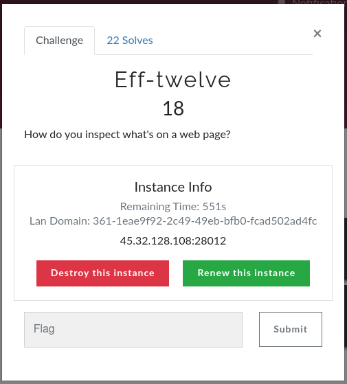

### EFF Twelve (Web)



Open in ```curl``` command

```shell
curl 45.32.128.108:28012
```

```
<!doctype html>
<html lang="en">
<head>
    <meta charset="utf-8">
    <meta name="viewport" content="width=device-width, initial-scale=1, shrink-to-fit=no">

    <title>Eff-twelve</title>
</head>
<body>
<p>How do you view the source of a page?</p>

<style type="text/css" scoped>
    body {

        background: -webkit-gradient(linear, left top, left bottom, color-stop(0.24, #009999), color-stop(1, #6666FF));
        background: -webkit-linear-gradient(top, #009999 24%, #6666FF 100%);
        background: -moz-linear-gradient(top, #009999 24%, #6666FF 100%);
        background: -o-linear-gradient(top, #009999 24%, #6666FF 100%);
        background: -ms-linear-gradient(top, #009999 24%, #6666FF 100%);
        background: linear-gradient(to bottom, #009999 24%, #6666FF 100%);

        color:#996600;
        height:225px;
        padding:1.5em;
        font-family:'Comic Sans MS';
        font-size:2em;
        line-height:1.3em;
    }
</style>
</body>
<!--FLAG: peaCTF{d6bef8bf-a99d-45e1-8835-3efd8f8564b9}-->
</html>
```

**Bingo**

> peaCTF{d6bef8bf-a99d-45e1-8835-3efd8f8564b9}